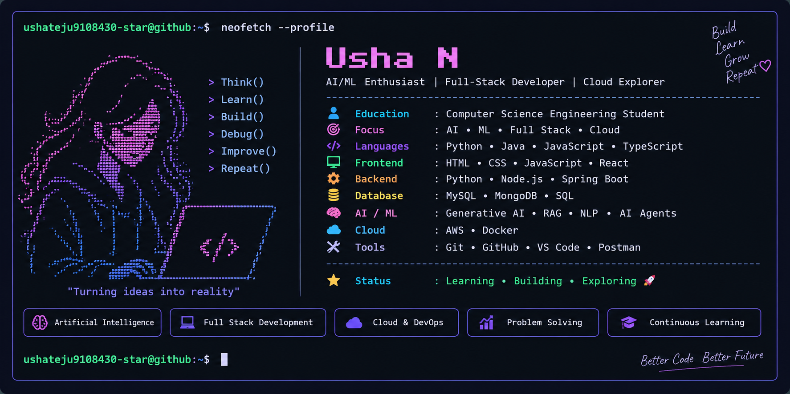

<p align="center">
  
</p>

<br>

<div align="center">

### 🤖 AI/ML Enthusiast • 💻 Full-Stack Developer • ☁️ Cloud Explorer

</div>

---

## 🟣 About Me

🎓 Computer Science Engineering Student

🤖 Passionate about Artificial Intelligence & Machine Learning

🧠 Exploring Generative AI, RAG, NLP and AI Agent Systems

💻 Building Full-Stack Web Applications

⚙️ Developing Backend Systems and APIs

☁️ Exploring Cloud Computing and DevOps

🐳 Working with Docker and containerized applications

🚀 Turning ideas into practical real-world projects

---

## 🛠️ Tech Stack

### 💻 Programming Languages

<p align="left">
  
</p>

### 🌐 Web & Backend

<p align="left">
  
</p>

### ☁️ Cloud & DevOps

<p align="left">
  
</p>

### 🧰 Development Tools

<p align="left">
  
</p>

### 🤖 AI / ML

<p align="center">

`Artificial Intelligence` • `Machine Learning` • `Generative AI`

`NLP` • `RAG` • `AI Agents`

</p>

---

# 🚀 Featured Projects

### 🤖 QwenLens

AI-focused web project exploring modern AI capabilities and intelligent application development.

**Tech:** HTML

🔗 **Repository:**  
https://github.com/ushateju9108430-star/qwenlens

---

### 🧠 AI Multi-Agent Task Automation System

An AI-oriented project focused on multi-agent systems and intelligent task automation.

**Tech:** JavaScript

🔗 **Repository:**  
https://github.com/ushateju9108430-star/AI-Multi-Agent-Task-Automation-System

---

### 🛒 Amazon Backend

A backend development project focused on application functionality and backend implementation.

**Tech:** Python

🔗 **Repository:**  
https://github.com/ushateju9108430-star/Amazon-backend

---

### 🌐 Usha Portfolio

A modern personal developer portfolio showcasing projects, technical skills, certifications, research work and experience.

**Tech:** TypeScript

🔗 **Repository:**  
https://github.com/ushateju9108430-star/usha-portfolio

---

### 💻 LeetCode Solutions

A collection of programming and problem-solving solutions developed through continuous practice.

**Tech:** Python

🔗 **Repository:**  
https://github.com/ushateju9108430-star/leetcode-solutions

---

# 📊 GitHub Analytics

<div align="center">


</div>

---

# 🔥 GitHub Streak

<div align="center">


</div>

---

# 📈 GitHub Activity

<div align="center">


</div>

---

# 🌱 Currently Exploring

<div align="center">

| 🤖 AI & ML | 💻 Development | ☁️ Cloud |
|:---:|:---:|:---:|
| Generative AI | Full-Stack Development | AWS |
| Machine Learning | Backend Development | Docker |
| RAG Systems | REST APIs | DevOps |
| NLP | React | Cloud Applications |
| AI Agents | Spring Boot | Deployment |

</div>

---

# 🎯 My Developer Journey

```text
        ┌─────────────┐
        │    LEARN    │
        └──────┬──────┘
               │
               ▼
        ┌─────────────┐
        │    BUILD    │
        └──────┬──────┘
               │
               ▼
        ┌─────────────┐
        │   EXPLORE   │
        └──────┬──────┘
               │
               ▼
        ┌─────────────┐
        │    DEPLOY   │
        └──────┬──────┘
               │
               ▼
        ┌─────────────┐
        │   IMPROVE   │
        └──────┬──────┘
               │
               ▼
             REPEAT 🔄
