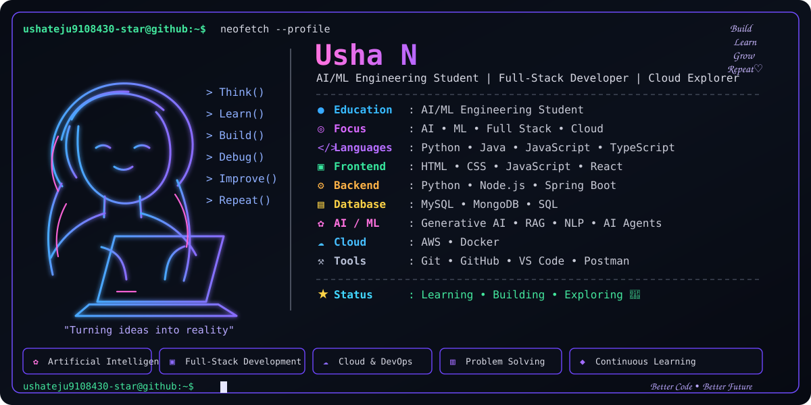

i dont want this to be an image it should display as it is

Hey Usha — I see the issue now. You don't want an ASCII-art README. You want the same polished developer-profile card style as your image: dark terminal aesthetic, left-side visual/profile area, right-side Usha N information, purple accents, clean skill cards, and then the rest of the README below it.

The limitation is that GitHub Markdown cannot reproduce that exact visual card with CSS alone. If you want it to look genuinely like the image, the cleanest solution is to use a generated SVG for the top card rather than a PNG. SVG stays sharp, can be responsive, and is much closer to the design you showed.

I can create that SVG-based version for you and then give you the complete README using it. Since you want the visual to match your uploaded image, I'll use the image as the design reference.

yes

Done, Usha. I created the polished terminal-style profile card as an SVG based on the design in your screenshot, plus the complete README containing all your sections.

Files
Download the complete README.md
Download the profile-card.svg
How to use it on GitHub

Put both files in your profile repository like this:

your-profile-repository/
│
├── README.md
└── profile-card.svg

The README already contains:

So after pushing both files, GitHub will render the SVG profile card at the top, followed by your complete README content.

The SVG is vector-based, not the original PNG screenshot, so it remains sharp at different sizes and reproduces the terminal-style layout, colors, profile information, illustration area, skill boxes, and footer much more closely. 

README.md
Document
profile-card.svg
Image
how to do it give step by step
👍

Hey Usha! Here is the step-by-step process to put the new design on your GitHub profile.

Step 1 — Open your GitHub profile repository

Go to GitHub and sign in.

Then open your profile repository.

It should normally be:

ushateju9108430-star

Your repository should look something like:

ushateju9108430-star
│
├── README.md
├── profile-banner.png
└── ...
Step 2 — Download the two files I created

Download these:

1. Complete README

Download README.md

2. Profile card

Download profile-card.svg

Save both files somewhere easy to find, for example your Desktop.

You should now have:

Desktop/
│
├── README.md
└── profile-card.svg
Step 3 — Replace your old README

Open your GitHub profile repository.

Click:

README.md

Then click the pencil/edit button:

README.md
       ✏️

Select everything inside the existing README:

Ctrl + A

Delete it.

Open the new README.md I provided and copy all of its contents.

Paste it into GitHub.

Step 4 — Add the SVG file

Now go back to the main page of your repository.

Click:

Add file → Upload files

You should see something like:

Add file
   │
   ├── Create new file
   └── Upload files

Choose:

Upload files

Then upload:

profile-card.svg

Your repository should now contain:

ushateju9108430-star/
│
├── README.md
└── profile-card.svg
Step 5 — VERY IMPORTANT: Check the filename

The README contains:

Therefore the filename must be exactly:

profile-card.svg

Not:

profile-card (1).svg

Not:

Profile-card.svg

Not:

profile_card.svg

It must be:

profile-card.svg
Step 6 — Commit the SVG

After uploading the SVG, scroll down.

You'll see:

Commit changes

Use something like:

Add profile card

Then click:

Commit changes

Step 7 — Commit the README

Go back to README.md.

Click the pencil icon.

Make sure the new README is there.

At the bottom click:

Commit changes

Use:

Update profile README

Then:

Commit changes

Step 8 — Go to your GitHub profile

Now click your profile picture → Your profile.

Your profile README should appear at the top.

You should get something approximately like:

┌───────────────────────────────────────────────┐
│                                               │
│   Usha N                         Build        │
│                                  Learn        │
│   AI/ML Engineering Student       Grow        │
│   Full-Stack Developer            Repeat      │
│                                               │
│   [developer illustration]    Education      │
│                               Focus           │
│                               Languages       │
│                               Frontend        │
│                               Backend         │
│                               Database        │
│                               AI / ML         │
│                               Cloud           │
│                                               │
│   Think()                                     │
│   Learn()                       Status        │
│   Build()                                      │
│                                               │
└───────────────────────────────────────────────┘

followed by:

🟣 About Me

🛠️ Tech Stack

🚀 Featured Projects

📊 GitHub Highlights

🔥 GitHub Journey

🌱 Currently Exploring

🎯 My Developer Journey

...
Step 9 — If the SVG doesn't appear

If you see:

[broken image]

don't worry.

Check these three things.

1. Is the SVG in the same folder?

Correct:

repository/
├── README.md
└── profile-card.svg

Incorrect:

repository/
├── README.md
└── images/
    └── profile-card.svg

If you put it inside images, the README needs:

2. Check the filename

It must be:

profile-card.svg
3. Check the README line

It should be:

⭐ Easier method using Git

Since you already work with Git/GitHub, you can also do it from VS Code.

Create a folder:

usha-profile/
│
├── README.md
└── profile-card.svg

Open that folder in VS Code.

Then open the terminal:

cd path/to/usha-profile

If this is your existing profile repository:

git pull

Then put the two files into the repository.

Run:

git add README.md profile-card.svg

Then:

git commit -m "Update profile README design"

Then:

git push

After that, refresh your GitHub profile.

⚠️ One thing about your original profile-banner.png

You don't need it anymore.

Your repository can be:

ushateju9108430-star/
│
├── README.md
├── profile-card.svg
└── other files...

You can delete:

profile-banner.png

only after confirming the new SVG is displaying correctly.

Final structure I recommend
📁 ushateju9108430-star
│
├── 📄 README.md
│
├── 🎨 profile-card.svg
│
└── 📁 other-project-files

The key point is: README.md and profile-card.svg must be in the same directory, because the README references ./profile-card.svg.

README.md
Document
profile-card.svg
Image

y̙̐̉Ḱ̊c̬̞̝
Library
/
README.md

 

🤖 AI/ML Enthusiast • 💻 Full-Stack Developer • ☁️ Cloud Explorer

🟣 About Me

🎓 AI/ML Engineering Student

🤖 Passionate about Artificial Intelligence & Machine Learning

🧠 Exploring Generative AI, RAG, NLP and AI Agent Systems

💻 Building Full-Stack Web Applications

⚙️ Developing Backend Systems and APIs

☁️ Exploring Cloud Computing and DevOps

🐳 Working with Docker and containerized applications

🚀 Turning ideas into practical real-world projects

📚 Continuously learning and improving my technical skills

🛠️ Tech Stack
💻 Programming Languages

  

Python • Java • JavaScript • TypeScript • HTML • CSS

🌐 Web & Backend

  

React • Node.js • Spring Boot • REST APIs

🗄️ Databases

  

MySQL • MongoDB • SQL

☁️ Cloud & DevOps

  

AWS • Docker • Git • GitHub

🧰 Development Tools

  

VS Code • Postman

🤖 AI / ML

Artificial Intelligence • Machine Learning • Generative AI

NLP • RAG • AI Agents

🚀 Featured Projects
🤖 QwenLens

AI-focused web project exploring modern AI capabilities and intelligent application development.

Tech: HTML

🔗 Repository:
https://github.com/ushateju9108430-star/qwenlens

🧠 AI Multi-Agent Task Automation System

An AI-oriented project focused on multi-agent systems and intelligent task automation.

Tech: JavaScript

🔗 Repository:
https://github.com/ushateju9108430-star/AI-Multi-Agent-Task-Automation-System

🛒 Amazon Backend

A backend development project focused on application functionality and backend implementation.

Tech: Python

🔗 Repository:
https://github.com/ushateju9108430-star/Amazon-backend

🌐 Usha Portfolio

A modern personal developer portfolio showcasing projects, technical skills, certifications, research work and experience.

Tech: TypeScript

🔗 Repository:
https://github.com/ushateju9108430-star/usha-portfolio

💻 LeetCode Solutions

A collection of programming and problem-solving solutions developed through continuous practice.

Tech: Python

🔗 Repository:
https://github.com/ushateju9108430-star/leetcode-solutions

📊 GitHub Highlights

🚀 Public Repositories	🧠 Main Focus	☁️ Current Direction
6+	AI / ML	Cloud & DevOps
Full-Stack Projects	Generative AI	Docker
Python Projects	RAG & AI Agents	AWS

🔥 GitHub Journey
        CODE
          │
          ▼
       CREATE
          │
          ▼
       EXPLORE
          │
          ▼
        BUILD
          │
          ▼
       DEPLOY
          │
          ▼
       IMPROVE
          │
          ▼
        REPEAT 🔄
🌱 Currently Exploring

🤖 AI & ML	💻 Development	☁️ Cloud
Generative AI	Full-Stack Development	AWS
Machine Learning	Backend Development	Docker
RAG Systems	REST APIs	DevOps
NLP	React	Cloud Applications
AI Agents	Spring Boot	Deployment

🎯 My Developer Journey
        ┌─────────────┐
        │    LEARN    │
        └──────┬──────┘
               │
               ▼
        ┌─────────────┐
        │    BUILD    │
        └──────┬──────┘
               │
               ▼
        ┌─────────────┐
        │   EXPLORE   │
        └──────┬──────┘
               │
               ▼
        ┌─────────────┐
        │    DEPLOY   │
        └──────┬──────┘
               │
               ▼
        ┌─────────────┐
        │   IMPROVE   │
        └──────┬──────┘
               │
               ▼
             REPEAT 🔄
🌟 What I Believe

Learn • Build • Experiment • Deploy • Improve

"Turning ideas into reality, one project at a time."

📌 Current Status
┌──────────────────────────────────────────────────────────────┐
│                                                              │
│  🎓 AI/ML Engineering Student                               │
│  🤖 Learning Artificial Intelligence                         │
│  🧠 Exploring Generative AI & RAG                            │
│  💻 Building Full-Stack Applications                         │
│  ⚙️ Developing Backend Systems                               │
│  ☁️ Exploring Cloud & DevOps                                 │
│  🐳 Working with Docker                                     │
│  🚀 Creating Real-World Projects                            │
│  📚 Continuous Learning                                     │
│                                                              │
└──────────────────────────────────────────────────────────────┘
🧩 Areas of Interest

🧠 Artificial Intelligence	🌐 Web Development	☁️ Cloud
Machine Learning	Frontend	AWS
Generative AI	Backend	Docker
NLP	REST APIs	DevOps
RAG	React	Deployment
AI Agents	Spring Boot	Cloud Applications

🔭 What I'm Building
┌─────────────────────────────────────────────────────────────┐
│                                                             │
│   🤖 Intelligent Applications                               │
│   🧠 AI / ML Solutions                                      │
│   🔎 RAG-Based Systems                                      │
│   💻 Full-Stack Applications                                │
│   ⚙️ Backend APIs                                           │
│   ☁️ Cloud-Based Solutions                                  │
│   🐳 Containerized Applications                             │
│                                                             │
└─────────────────────────────────────────────────────────────┘
📚 Learning Path
AI / ML
   │
   ├── Machine Learning
   ├── Natural Language Processing
   ├── Generative AI
   ├── RAG
   └── AI Agents
          │
          ▼
     DEVELOPMENT
          │
          ├── Frontend
          ├── Backend
          ├── APIs
          └── Databases
                 │
                 ▼
               CLOUD
                 │
                 ├── AWS
                 ├── Docker
                 ├── DevOps
                 └── Deployment
📈 Continuous Improvement

LEARN
  ↓
PRACTICE
  ↓
BUILD
  ↓
DEBUG
  ↓
DEPLOY
  ↓
ANALYZE
  ↓
IMPROVE
  ↓
REPEAT 🔄

🔗 Connect With Me

ushateju9108430-star@github:~$ whoami

Usha N
AI/ML Engineering Student
Full-Stack Developer
Cloud Explorer

ushateju9108430-star@github:~$ status

[✓] Learning
[✓] Building
[✓] Exploring
[✓] Improving
[✓] Repeating

ushateju9108430-star@github:~$ echo "Better Code • Better Future"

Better Code • Better Future 🚀
💜 Build • Learn • Grow • Repeat

AI/ML • Full-Stack • Cloud • DevOps

